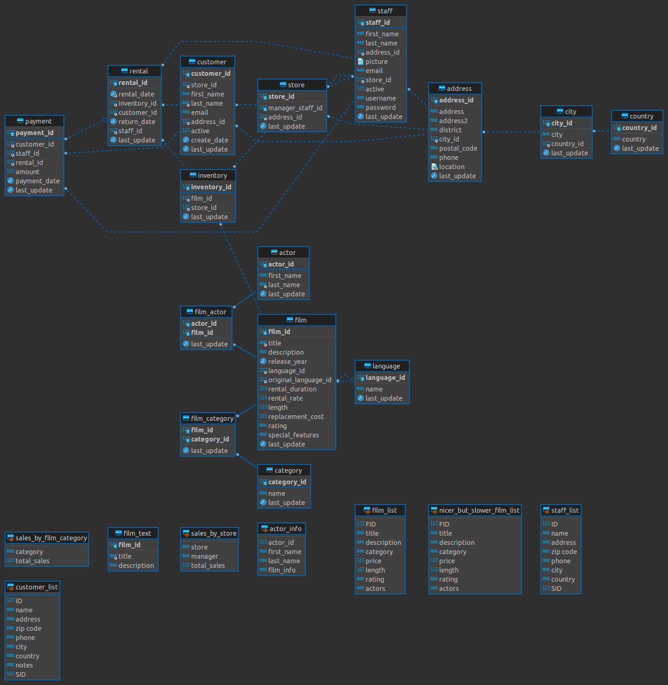

# SELECT JOINS

Execute o source do sakila db


## INNER JOIN
```
SELECT 'INNER JOIN' AS '';
SELECT 'Retorna linhas quando houver pelo menos uma correspondência em ambas as tabelas' AS '';

SELECT
    city.city,
    country.country
FROM
    city
INNER JOIN
    country ON country.country_id = city.country_id ;
```

## INNER JOIN com mais de uma tabela
```

SELECT 'INNER JOIN com mais de uma tabela' AS '';

SELECT
    address.address,
    address.phone,
    city.city,
    country.country
FROM  
    address
INNER JOIN 
    city ON address.city_id = city.city_id
INNER JOIN
    country ON country.country_id = city.country_id ;

```

## INNER JOIN adicionando limit

```
SELECT 'Adicionando um LIMIT na query' AS '';

SELECT
    address.address,
    address.phone,
    city.city,
    country.country
FROM  
    address
INNER JOIN 
    city ON address.city_id = city.city_id
INNER JOIN
    country ON country.country_id = city.country_id 
LIMIT 30;


```


## LEFT JOIN adicionando limit

```

SELECT 'LEFT JOIN' AS '';

SELECT 'Retorna todas as linhas da tabela à esquerda, mesmo se não houver nenhuma correspondência na
tabela à direita' AS '';


SELECT
    address.address_id,
    address.address,
    address.phone,
    city.city,
    city.city_id
FROM  
    address
LEFT JOIN 
    city ON address.city_id = city.city_id;

SELECT
    address.address_id,
    address.address,
    address.phone,
    city.city,
    city.city_id
FROM  
    address
INNER JOIN 
    city ON address.city_id = city.city_id
LIMIT 10;    
```


## COMPARAÇÃO INNER X LEFT depois do INSERT

```

SELECT 'Comparando INNER COM LEFT' AS '';


INSERT INTO city
    (
        city,
        country_id
    )
VALUES
    (
        'Curitiba',
        16
    );

SELECT 'LEFT --------------' AS '';

SELECT
    address.address_id,
    address.address,
    address.phone,
    city.city,
    city.city_id
FROM  
    city
LEFT JOIN 
    address ON address.city_id = city.city_id
WHERE city.city = 'Curitiba';


SELECT 'INNER --------------' AS '';


SELECT
    address.address_id,
    address.address,
    address.phone,
    city.city,
    city.city_id
FROM  
    city
INNER JOIN 
    address ON address.city_id = city.city_id    
WHERE city.city = 'Curitiba';

```

## RIGHT JOIN  

```

SELECT 'RIGHT JOIN' AS '';

SELECT 'Retorna todas as linhas da tabela à direita, mesmo se não houver nenhuma correspondência na
tabela à direita' AS '';


SELECT
    address.address_id,
    address.address,
    address.phone,
    city.city,
    city.city_id
FROM  
    city
RIGHT JOIN 
    address ON address.city_id = city.city_id    
WHERE city.city = 'Curitiba';

SELECT 'INVERTENDO --------------' AS '';

SELECT
    address.address_id,
    address.address,
    address.phone,
    city.city,
    city.city_id
FROM  
    address
RIGHT JOIN 
    city ON address.city_id = city.city_id    
WHERE city.city = 'Curitiba';

```

## JOIN com WHERE  


```
SELECT 'JOINS com WHERES' AS '';


SELECT
    customer.first_name,
    customer.last_name,
    customer.email,
    customer.active,
    address.address,
    address.phone,
    city.city,
    country.country
FROM
    customer
LEFT JOIN 
    address ON customer.address_id = address.address_id
LEFT JOIN
    city ON address.city_id = city.city_id
LEFT JOIN
    country ON city.country_id = country.country_id
WHERE 
    customer.first_name IN ('DAVE','BOB','DARYL','MORRI')
;
```


## Exercícios




1 Traga todas as datas de locação da Barbara Jones (veja tabela customer, payment, rental)

2 Dado exercício 1, limite o resultado em apenas 10.

3 Busque todos os filmes que foram locados por MELISSA

4 Busque todos os atores que foram assistidos por DEBORAH e por ANGELA 

5 Busque todos os atores que foram assistidos por DEBORAH ou por ANGELA 

6 Busque a quantidade de clientes que assistiu a categoria de filmes *Comedy*

7 Busque os clientes que assistiram filmes japoneses

8 Busque todos os filmes que foram assistidos pelos cidadãos de Brasilia

9 Crie um banco de dados chamado Bar. Esse banco de dados deve representar as bebidas do bar e os seus respectivos consumidores.

9.1 Na tabela de bebidas, registre vodka, conhaque e uisque

9.2 Na tabela consumidores, registre João, Alexandre e Henrique

9.3 Crie uma estrutura capaz de representar os seguintes consumos:
* João consumiu vodka
* João consumiu conhaque
* Alexandre consumiu uisque
* Alexandre consumiu vodka
* Henrique consumiu vodka
* Henrique consumiu uisque

9.4 Crie uma query que trás todo consumo de João

9.5 Crie uma query que trás todas Bebidas consumidas por Alexandre e Henrique

9.6 Crie uma query que trás todas as Bebidas consumidas por João ou por Henrique