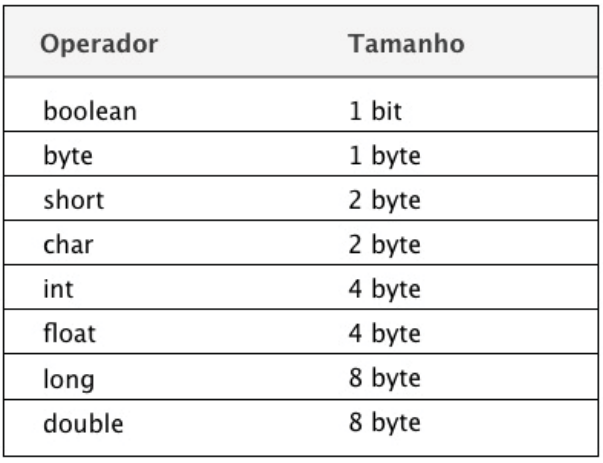

# Aula 3 - Orientação a objetos

## Referências:
* __Turini, Rodrigo - Desbravando Java e Orientação a Objeto - Um guia para o iniciante da linguagem__
* __Furgei, Sérgio__ - Programação orientada a objetos: Conceitos e técnicas Capa comum – 31 março 2014
* __Herbert Schildt__, __Maria Lúcia Blanck Lisbôa Aldir José Coelho Corrêa da Silva__ - Java para Iniciantes: Crie, Compile e Execute Programas Java Rapidamente


## Revisão

* Como compilar e executar um arquivo Java por linha de comando
* Como iniciar um projeto básico Java no IntelliJ
* Declaração e atribuição de variáveis
```
public class CalculadoraDeEstoque {

    public static void main(String[] args) {
        double livroJava8;
        double livroTDD;

        livroJava8 = 59.90;
        livroTDD = 59.90;
    }
}
```

* Tipos primitivos - Tipos de variáveis que a linguagem nos fornece.



* Condicionais

```
if (soma < 150) {
    System.out.println("Seu estoque está muito baixo!");
} else {
    System.out.println("Seu estoque está bom");
}
```


* Laços de repetição

```
double soma = 0;
int contador = 0;

while (contador < 35) {
    double valorDoLivro = 59.90;
    soma = soma + valorDoLivro;
    contador = contador + 1;
}
```

...


```
for (double i = 0; i < 35; i ++) {
    soma += 59.90;
}
```


## Orientação a objetos

* Paradigma de Programação
* Apresenta uma alta abstração, funcionando de forma mais próxima a realidade humana.
* Os problemas são resolvidos por meio de objetos que interagem entre si.
* Esses objetos possuem estados (atributos).
* Esses objetos também possuem comportamentos (métodos).


```
public class CalculadoraDeEstoque {
    public static void main(String[] args) {
        double soma = 0;

        for (double i = 0; i < 35; i ++) {
            soma += 59.90;
        }

        System.out.println("O total em estoque é "+ soma);

        if (soma < 150) {
            System.out.println("Seu estoque está muito baixo!");
        } else if (soma >= 2000) {
            System.out.println("Seu estoque está muito alto!");
        } else {
            System.out.println("Seu estoque está bom");
        }
    }
}
```

* O valor 59.90 representa o valor do livro.
* Como, usamos o paragima procedural, podemos pensar em uma estrutura de dados que correlaciona informações como nome, descrição e demais informações?
* Na orientação a objeto podemos criar um objeto que representa todas essas informações.

Podemos criar uma classe Livro.

```
class Livro {

}
```

Ela pode conter os atributos das classes:


```
class Livro {
    String nome;
    String descricao;
    double valor;
    String isbn;
}
```

* Esses campos não são populados na casse Livro, é apenas um molde. Precisamos criar umm objeto a partir desse molde. Para criar o objeto desse livro, fazemos da seguinte forma:

```
Livro livro = new Livro();
```

* Podemos acessar os atributos dessa classe:

```
Livro livro = new Livro();
livro.nome = "Java 8 Prático";
livro.descricao = "Novos recursos da linguagem";
livro.valor = 59.90;
livro.isbn = "978-85-66250-46-6";
```

Logo: 

```
public class CadastroDeLivros {
    public static void main(String[] args) {
        Livro livro = new Livro();
        livro.nome = "Java 8 Prático";
        livro.descricao = "Novos recursos da linguagem";
        livro.valor = 59.90;
        livro.isbn = "978-85-66250-46-6";

        System.out.println(livro.nome);
        System.out.println(livro.descricao);
        System.out.println(livro.valor);
        System.out.println(livro.isbn);
    }
}

class Livro {
    String nome;
    String descricao;
    double valor;
    String isbn;
}
```

Terá o seguinte resultado:

```
Java 8 Prático
Novos recursos da linguagem
59.9
978-85-66250-46-6
```

* __Classe:__ Uma classe é apenas um molde. Uma especificação que define para a máquina virtual o que um objeto desta classe deverá ter como ele deve se comportar.
* __Objeto:__ A livraria poderá ter milhares de objetos, mas estirá apenas uma classe _Livro_


* Podemos ter mais de um objeto por classe: 

```
public class CadastroDeLivros {
    public static void main(String[] args) {
        
        Livro livro = new Livro();
        
        livro.nome = "Java 8 Prático";
        livro.descricao = "Novos recursos da linguagem";
        livro.valor = 59.90;
        livro.isbn = "978-85-66250-46-6";
        
        System.out.println(livro.nome);
        System.out.println(livro.descricao);
        System.out.println(livro.valor);
        System.out.println(livro.isbn);
        
        Livro outroLivro = new Livro();
        
        outroLivro.nome = "Lógica de Programação";
        outroLivro.descricao = "Crie seus primeiros programas";
        outroLivro.valor = 59.90;
        outroLivro.isbn = "978-85-66250-22-0";
        
        System.out.println(outroLivro.nome);
        System.out.println(outroLivro.descricao);
        System.out.println(outroLivro.valor);
        System.out.println(outroLivro.isbn);
    }
}
```


## Métodos

Toda vez que queremos exibir as informações do livro, precisamos invocar: 

```
System.out.println(livro.nome);
System.out.println(livro.descricao);
System.out.println(livro.valor);
System.out.println(livro.isbn);
```

Isso torna o nosso código muito verboso e bastante repetitivo. Podemos montar um método dentro da classe com a seguinte estrutura:

```
tipoDeRetorno nomeDoComportamento() {
// código que será executado
}

```

Logo, dentro do contexto da classe Livro, o código ficaria assim:

```
class Livro {

    String nome;
    String descricao;
    double valor;
    String isbn;

    void mostrarDetalhes() {
        String mensagem = "Mostrando detalhes do livro";
        System.out.println(mensagem);

        System.out.println(nome);
        System.out.println(descricao);
        System.out.println(valor);
        System.out.println(isbn);
    }
}
```

Logo: 

```
public class CadastroDeLivros {
    public static void main(String[] args) {
        
        Livro livro = new Livro();
        
        livro.nome = "Java 8 Prático";
        livro.descricao = "Novos recursos da linguagem";
        livro.valor = 59.90;
        livro.isbn = "978-85-66250-46-6";
        
        livro.mostrarDetalhes();
        
        Livro outroLivro = new Livro();
        
        outroLivro.nome = "Lógica de Programação";
        outroLivro.descricao = "Crie seus primeiros programas";
        outroLivro.valor = 59.90;
        outroLivro.isbn = "978-85-66250-22-0";
        
        outroLivro.mostrarDetalhes();
    }
}

class Livro {

    String nome;
    String descricao;
    double valor;
    String isbn;

    void mostrarDetalhes() {
        String mensagem = "Mostrando detalhes do livro";
        System.out.println(mensagem);

        System.out.println(nome);
        System.out.println(descricao);
        System.out.println(valor);
        System.out.println(isbn);
    }
}
```

## Exercícios

_Referência: https://awari.com.br/10-exercicios-de-programacao-orientada-a-objetos-para-voce-praticar-agora-mesmo/?utm_source=blog&utm_campaign=projeto+blog&utm_medium=10%20exerc%C3%ADcios%20de%20programa%C3%A7%C3%A3o%20orientada%20a%20objetos%20para%20voc%C3%AA%20praticar%20agora%20mesmo!_


* Crie uma classe chamada “Círculo” que possua um atributo para armazenar o raio e métodos para calcular a área e o perímetro do círculo.

* Implemente uma classe chamada “ContaBancária” que possua atributos para armazenar o número da conta, nome do titular e saldo. Adicione métodos para realizar depósitos e saques.

* Crie uma classe chamada “Retângulo” que possua atributos para armazenar a largura e a altura. Implemente métodos para calcular a área e o perímetro do retângulo.

* Implemente uma classe chamada “Aluno” que possua atributos para armazenar o nome, a matrícula e as notas de um aluno. Adicione métodos para calcular a média das notas e verificar a situação do aluno (aprovado ou reprovado).

* Crie uma classe chamada “Funcionário” com atributos para armazenar o nome, o salário e o cargo do funcionário. 

* Implemente métodos para calcular o salário líquido, considerando descontos de impostos e benefícios.

* Implemente uma classe chamada “Produto” que possua atributos para armazenar o nome, o preço e a quantidade em estoque. Adicione métodos para calcular o valor total em estoque e verificar se o produto está disponível.

* Crie uma classe chamada “Triângulo” com atributos para armazenar os três lados do triângulo. Implemente métodos para verificar se é um triângulo válido e calcular sua área.

* Implemente uma classe chamada “Carro” com atributos para armazenar a marca, o modelo e a velocidade atual do carro. Adicione métodos para acelerar, frear e exibir a velocidade atual.

* Crie uma classe chamada “Paciente” que possua atributos para armazenar o nome, a idade e o histórico de consultas de um paciente. Implemente métodos para adicionar uma nova consulta ao histórico e exibir as consultas realizadas.

* Implemente uma classe chamada “Livro” com atributos para armazenar o título, o autor e o número de páginas do livro. Adicione métodos para emprestar o livro, devolvê-lo e verificar se está disponível.