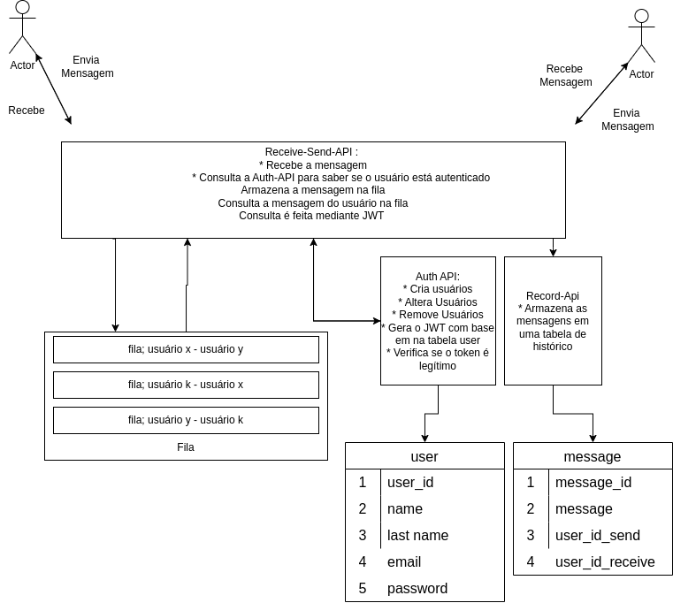

# Avaliação Final

* Criar um sistema de chat usando microserviços, tabelas e apis.

## Regras gerais
* Deve ser no máximo em dupla
* Toda api que tiver que chamar uma outra api, deve fazer isso via classe Client
* Lógicas de regra de negócio devem estar em classes de Service
* Toda api que chamar uma tabela, deve fazer isso via Model 


## Mostrar funcionando (24/06)

__Usuários:__
* usuário 1, usuario1@email.com senha123
* usuário 2, usuario2@email.com senha321
* usuário 3, usuario1@email.com senha123
* usuário 4, usuario1@email.com senha321

* Usuário 1 manda mensagem para usuário 4: Olá, tudo bem?
* Usuário 4 manda mensagem para usuário 3: Está chovendo hoje
* Usuário 2 manda mensagem para usuário 1: Quer ir para a minha casa hoje 


Para os três casos, mostrar funcionando:
1 - autenticação em todos os endpoints
2 - endpoint que envia a mensagem
3 - endpoint que recebe a mensage

A apresentação deverá ser feita na semana 24/06, haverá 5 minutos por apresentação.

* endpoints funcionando para todos os casos,
* registro nas tabelas.

## Arquitetura



## Entregar documento final conforme o template (28/06 23:59):

* Entrega 28/06 23:59
* Trabalho individual
* Template: 
    * Fonte 1: https://docs.google.com/document/d/1P-0exnYfZ-t5VKy55pMjh_-_JA8hYw3vk6PB29bZPI0/edit?usp=sharing
    * Fonte 2: https://github.com/joneng2016/ensino/blob/master/integracao_de_sistemas/documentos/Padr%C3%A3o%20Projeto%20Final.docx
    
## Estrutura Geral de cada serviço

### Receive-Send-API
    * Recebe a mensagem
    * Consulta a Auth-API para saber se o usuário está autenticado
    * Armazena a mensagem na fila
    * Consulta a mensagem do usuário na fila
    * Consulta é feita mediante JWT 
 
__POST /message__

header

```
{
    Authorization: token
}
```

payload

```
{
    userIdSend,
    userIdReceive,
    message
}
```

response

```
{
    message: 'mesage sended with success'
}
``` 

pseudo-codigo da controller

```

const authApiResponse = chamaAuthApiVerificaSeEstaAutenticado(
    headers.token,
    body.userIdSend
)

if (!authApiResponse.data.auth) {
    return {
        msg: 'not auth'
    }
} 

enviaParaAFila(
    {
        queue:`${body.userIdSend}${body.userIdReceive}`,
        message:body.message
    }
)

chamaApiEscreveMensagemNaTabelaDeHistorico(
    body.userIdSend,
    body.userIdReceive,
    message
)

```

__GET /message__

QueryString
```
?user=userId
```

header

```
{
    Authorization: token
}
```

response 

```
{
    [
        userId:'usuário 1'
        msg: 'Mensagem'
    ],
    [
        userId:'usuário 2'
        msg: 'Mensagem'
    ],
    ...
    [
        userId:'usuário 3'
        msg: 'Mensagem'
    ]
}
```


pseudo-codigo da controller

```

const authApiResponse = chamaAuthApiVerificaSeEstaAutenticado(
    headers.token,
    body.userId
)

if (!authApiResponse.data.auth) {
    return {
        msg: 'not auth'
    }
}


const users = chamaAuthApiPegaTodosOsUsuariosDaBase();


const msgs = users.map(user => {
    return consultaMesagemDaFilaPorCanal(`${user.Id}${body.userId}`)
})

return criaFormatoMessage(msgs);
```


### Auth-API

__GET token__

header

```
{
    Authorization: token
}
```

QueryString

```
?user=userId
```

response


Se está autenticado
```
{
    auth:true
}
```
Se não
```
{
    auth:false
}
```

pseudo-codigo controller

```
const userId = queryString.userId
const token = header.token;

if (!token) {
    return {auth:false}
}

const userObject = chamaModelUser(userId);
const obejectToken = decodeTokenPeloJwt(token);

if (obejectToken.userId === userObject.id &&  
    obejectToken.password === userObject.password
) {
    return {
        auth:true
    }
}

return {
    auth:false
}
```

__POST token__

payload

```
{
    email,
    password
}
```

response
```
{ 
    token: token
}
```

pseudo-codigo controller
```

const user = chamaModelDaUser(
    body.user.email,
    body.user.password
)

if (!user) {
    return {
        token: false
    }
}


const token = jwtTokenGenerate(
    {email: user.email, password: user.password}
)
```

__POST user__

payload

```
{
    name,
    lastName,
    email,
    password
}
```

response

se a criação ocorreu com sucesso,
```
{
    message:'ok',
    user: {
        name,
        lastName,
        email,
        password
    }
}
```

pseudo-codigo controller

```
trivial
```

__GET user__

QueryString

```
?email=
```

response

```
{
    name,
    lastName,
    email,
    password
}

```


pseudo-codigo controller

```
trivial
```

### Record-API


__POST__ message 


payload

```
{
    message,
    userIdSend,
    userIdReceive
}
```


response
```
{
    ok
}
```


pseudo-codigo controller

```
trivial
```

### Critérios de avaliação

* Apresentação: 1 ponto
* Todos os serviços codificados: 2 pontos
* Respeito dos Padrões de Software: 1 pontos
* Respeito dos Padrões de Documento: 1 ponto
