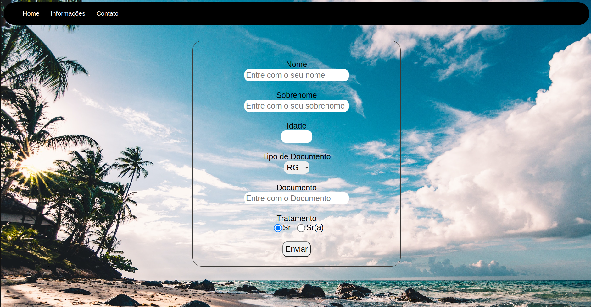
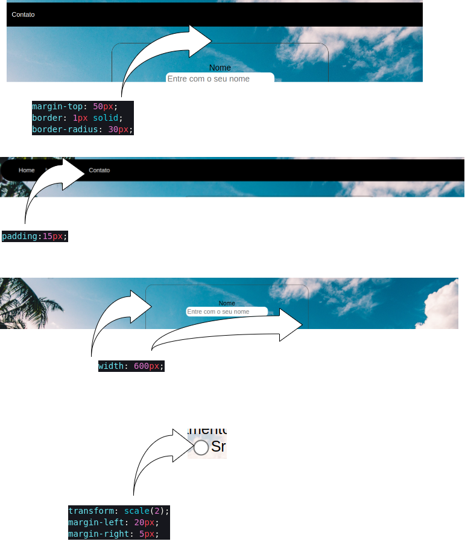

# Primeira Avaliação

## Desenvolver a seguinte tela

Vamos supor que você é um desenvolvedor frontend trabalhando em uma empresa. Você recebe a seguinte imagem (montanda em figma):




Sua tarefa consiste em reproduzir essa tela no mais fiel possível usando HTML e CSS

**Sempre que possível use a tage semântica apropriada - main, section, article, header, footer...**


## Orientações

### Imagem de fundo

A imagem de fundo pode ser encontrada no seguinte link

https://github.com/joneng2016/ensino/blob/master/introducao_ao_desenvolvimento_web/primeira_avaliacao/img/praia.jpg

Para adicionar a imagem no fundo de tal forma preencha todo o element (no caso, tag body), você pode usar o seguinte css:

```
body {
    background-image: url("img/praia.jpg");
    background-repeat: no-repeat;
    background-size: cover;
    font-family: 'Gill Sans', 'Gill Sans MT', Calibri, 'Trebuchet MS', sans-serif;
}
```


Talvez você encontre grandes dificuldades em centralizar o formulário, você pode usar a seguinte sugestão:


```
    margin-left: auto;
    margin-right: auto;
```


A imagem a seguir fornece mais orientações a respeito de distâncias e cor

*faltou a cor da borda em torno do formulário, que é:*
```
    border-color: rgb(59, 57, 54);
```


