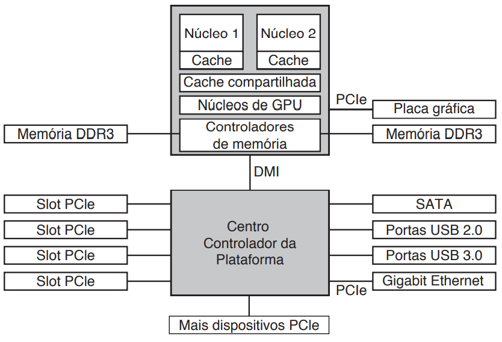

# Aula - Barramento

* À medida que os processadores e as memórias foram ficando mais rápidos, a capacidade de um único barramento (e certamente o barramento do PC IBM) de lidar com todo o tráfego foi exigida até o limite. Algo tinha de ceder.
* Como resultado, barramentos adicionais foram acrescentados, tanto para dispositivos de E/S mais rápidos quanto para o tráfego CPU para memória.
* Como consequência dessa evolução, um sistema x86 grande atualmente se parece com algo como a Figura a seguir.

* Este sistema tem muitos barramentos (por exemplo, cache, memória, PCIe, PCI, USB, SATA e DMI), cada um com uma taxa de transferência e função diferentes.
* O sistema operacional precisa ter ciência de todos eles para configuração e gerenciamento.
* O barramento principal é o PCIe (Peripheral Component Interconnect Express — interconexão expressa de componentes periféricos).
* O PCIe foi inventado pela Intel como um sucessor para o barramento PCI mais antigo, que por sua vez foi uma substituição para o barramento ISA (Industry Standard Architecture — arquitetura padrão industrial).
* Capaz de transferir dezenas de gigabits por segundo, o PCIe é muito mais rápido que os seus predecessores

* Uma arquitetura de barramento compartilhado significa que múltiplos dispositivos usam os mesmos fios para transferir dados.
* Quando múltiplos dispositivos têm dados para enviar, você precisa de um árbitro para determinar quem pode utilizar o barramento.
* Em comparação, o PCIe faz uso de conexões dedicadas de ponto a ponto
* Uma arquitetura de barramento paralela como usada no PCI tradicional significa que você pode enviar uma palavra de dados através de múltiplos fios. Por exemplo, em barramentos PCI regulares, um único número de 32 bits é enviado através de 32 fios paralelos

* Em comparação com isso, o PCIe usa uma arquitetura de barramento serial e envia todos os bits em uma mensagem através de uma única conexão, chamada faixa, de maneira muito semelhante a um pacote de rede.
* Isso é muito mais simples, pois você não tem de assegurar que todos os 32 bits cheguem ao destino exatamente ao mesmo tempo.
* O paralelismo ainda é usado, pois você pode ter múltiplas faixas em paralelo.
* Por exemplo, podemos usar 32 faixas para carregar 32 mensagens em paralelo.
* À medida que a velocidade de dispositivos periféricos como cartões de rede e adaptadores de gráficos aumenta rapidamente, o padrão PCIe é atualizado a cada 3-5 anos. 
* Por exemplo, 16 faixas de PCIe 2.0 oferecem 64 gigabits por segundo. Atualizar para PCIe 3.0 dará a você duas vezesaquela velocidade e o PCIe 4.0 dobrará isso novamente.

* Ainda temos muitos dispositivos de legado do padrão PCI mais antigo.
* No futuro, quando virmos o PCI não mais como meramente velho, mas ancestral, é possível que todos os dispositivos PCI vão se ligar a mais um centro ainda que, por sua vez, vai conectá-los ao centro principal, criando uma árvore de barramentos.