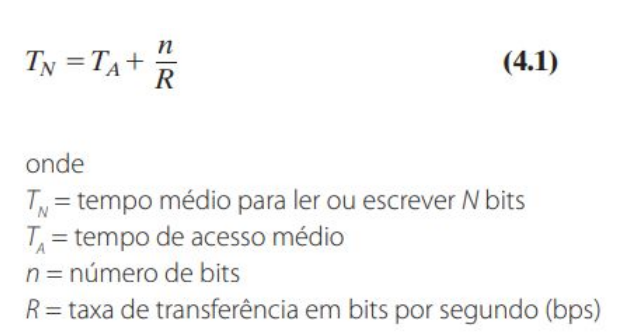
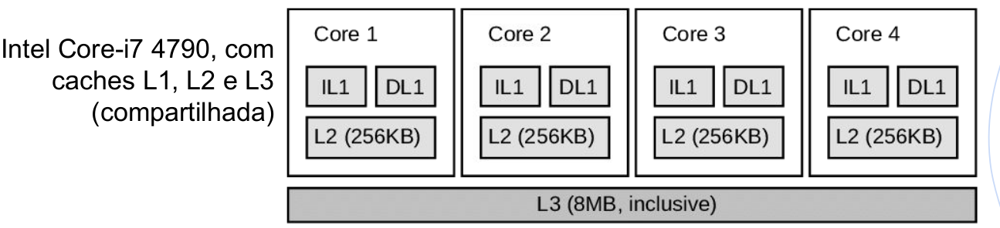
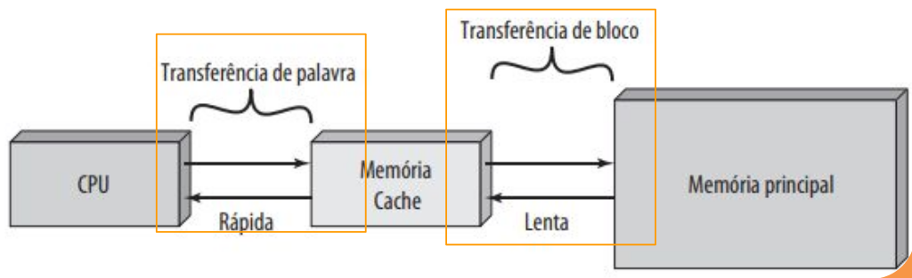
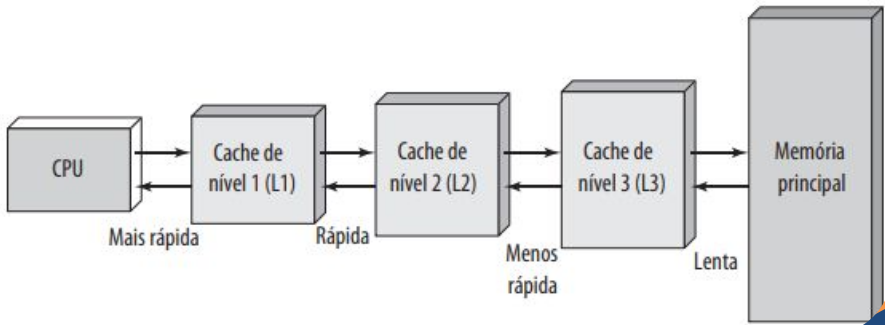
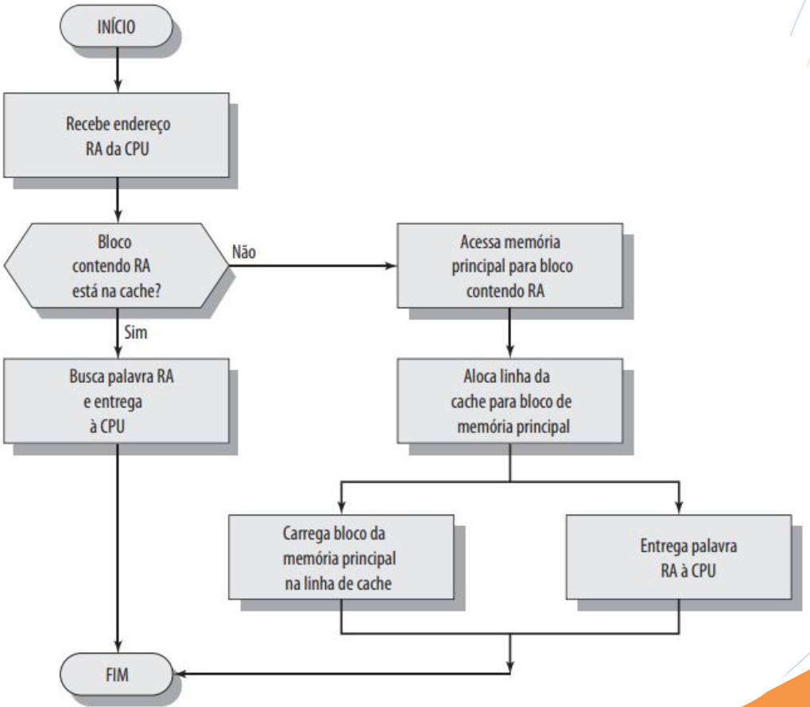
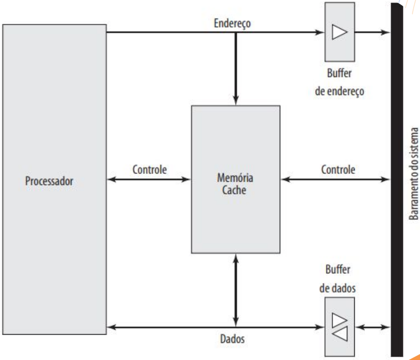

# Aula 3 - Memória

* A memória do computador é organizada em uma hierarquia.
* No nível mais alto (mais perto do processador), estão os *registradores do processador*.
* Níveis de cache: Quando são usados múltiplos níveis, eles são indicados por
L1, L2 e assim por diante.
* Em seguida, vem a memória principal, que normalmente é uma memória dinâmica de acesso aleatório e dinâmico (DRAM). 
* Todos estas anteriores são considerados internas ao sistema de computação. 
* A hierarquia continua com a memória externa, com o próximo nível geralmente sendo um disco rígido fixo, e um ou mais níveis abaixo disso consistindo em mídia removível, como discos ópticos e fita.
* internas ao sistema: acessíveis diretamente pelo processador
* externas: acessíveis pelo processador por meio de um módulo de E/S
* À medida que descemos na hierarquia da memória, encontramos:
    * custo/ bit menor,
    * capacidade maior e
    * tempo de acesso mais lento
* Seria bom usar apenas a memória mais rápida, mas como ela é a memória mais cara, trocamos tempo de acesso pelo custo, usando mais da memória mais lenta
* O desafio de projeto é organizar os dados e os programas na memória de modo que as palavras de memória acessadas normalmente estejam na memória mais rápida
* Se a memória cache for projetada corretamente, então, na maior parte do tempo, o processador solicitará palavras da memória que já estão na cache, e não precisará buscar na DRAM.
* As restrições de projeto sobre a memória de um computador podem ser resumidas por três questões:
  - Quanto?
  - Com que velocidade?
  - Com que custo?

* **Quanto?** Se houver capacidade de armazenamento, os programas provavelmente usarão essa capacidade
* **Com que velocidade?** Para conseguir maior desempenho, a memória precisa ser capaz de acompanhar a velocidade do processador. Enquanto o processador está executando instruções, não gostaríamos que ele tivesse que parar, aguardando por instruções ou operandos da memória.
* **Com que custo?** Para um sistema prático, o custo da memória deve ser razoável em relação a outros componentes

* Diversas tecnologias são usadas para implementar sistemas de memória e, por meio delas existem as seguintes relações:
  * Tempo de acesso mais rápido, maior
custo por bit.
  * Maior capacidade, menor custo por bit.
  * Maior capacidade, tempo de acesso mais lento.

* O projetista enfrenta um dilema: ele gostaria de usar tecnologias com grande capacidade de memória, porque a capacidade é necessária e porque o custo por bit é baixo. Porém, para atender os requisitos de desempenho, ele precisa usar memórias caras, relativamente com menor capacidade e com menores tempos de acesso.

* Para sair desse dilema, é preciso não contar com um único componente ou tecnologia de memória, mas empregar uma hierarquia de memória.

* Assim, memórias menores, mais caras e mais rápidas são complementadas por memórias maiores, mais baratas e mais lentas.

* A chave para o sucesso dessa organização é a diminuição na frequência de acesso.

## Principais Características das Memórias

### Capaciade de Memória

* Para a memória interna, isso normalmente é expresso em termos de bits ou palavras. Os tamanhos comuns de palavra são 8, 16 e 32 bits.
* A capacidade da memória externa normalmente é expressa em termos de bytes.

### Unidade de Transferência de Memórias

* Para a memória interna, a unidade de transferência é igual ao número de linhas elétricas para dentro e para fora do módulo de memória. Isso pode ser igual ao tamanho da palavra, mas normalmente
é maior, como 64, 128 ou 256 bytes.
* O tamanho da palavra normalmente é igual ao número de bits usados para representar um inteiro e ao tamanho da instrução.
* Palavra: a unidade “natural” de organização da memória.
* Unidades Endereçáveis:em alguns sistemas, a unidade endereçável é a palavra. Muitos sistemas também permitem o endereçamento no nível de byte. O relacionamento entre o tamanho em bits A de um endereço e o número N de unidades endereçáveis é $2^{A}$ = N.
* unidade de transferência: para a memória principal (interna), este é o número de bits lidos ou escritos na memória de uma só vez.
* A unidade de transferência não precisa ser i necessariamente igual a uma palavra ou uma unidade endereçável. Para a memória externa, os dados normalmente são transferidos
em unidades muito maiores que uma palavra e estas são chamadas de **blocos**.

## Métodos de Acesso - Memória

* **Acesso sequencial**: a memória é organizada em unidades de dados chamadas registros. O acesso é feito em uma sequência linear específica. O tempo para acessar um registro qualquer é altamente variável. As unidades de fita são de acesso sequencial.
* **Acesso direto**: os blocos ou registros individuais têm um endereço
exclusivo, baseado no local físico. O tempo de acesso é variável.
* **Acesso aleatório**: cada local endereçável na memória tem um mecanismo de endereçamento exclusivo, fisicamente interligado. O tempo para acessar determinado local é independente da sequência de acessos anteriores, e é constante. Assim, qualquer local pode ser selecionado aleatoriamente, e endereçado e acessado diretamente. A memória principal e alguns sistemas de cache são de acesso
aleatório.
* **Associativo**: tipo de memória de acesso aleatório que permite fazer uma comparação de um certo número de bit desejados dentro de uma palavra para uma combinação especificada, e faz isso para todas as palavras simultaneamente. Assim, uma palavra é recuperada com base em uma parte de seu conteúdo, em vez do seu endereço. o tempo de recuperação é constante, independentemente do local ou padrões de acesso anteriores. As memórias cache podem empregar o acesso associativo.

## Desempenho

* **Tempo de acesso (latência)**: para a memória de acesso aleatório, esse é o tempo gasto para realizar uma operação de leitura ou escrita, ou seja, o tempo desde o instante em que um endereço é apresentado à memória até o instante em que os dados foram armazenados ou se tornaram disponíveis para uso.
* Para a memória de acesso não aleatório, o tempo de acesso é o tempo gasto para posicionar o mecanismo de leitura-escrita no local desejado.
* **Tempo de ciclo de memória:** 
  * aplicado principalmente à memória de acesso aleatório, e consiste no tempo de acesso à memória mais qualquer tempo adicional antes que um segundo acesso possa iniciar
  * Esse tempo adicional pode ser exigido para a preparação das linhas do barramento, por exemplo. Observe que o tempo de ciclo de memória se refere ao barramento do sistema, e não do processador.
  * Ou seja, este tempo de ciclo de memória é um tempo decorrido entre duas operações consecutivas a memória
  * Ciclo de memória = tempo de acesso + tempo para atividades internas do sistema
  * Taxa de transferência: essa é a taxa em que os dados podem ser transferidos para dentro ou fora de uma unidade de memória.
  * Para a memória de acesso aleatório, ela é igual a 1/(tempo de ciclo).
  * Para a memória de acesso não aleatório, existe a seguinte relação:

## Tecnologias de Memória

Diversas tecnologias de memória foram empregadas. As mais comuns hoje são:
* memória semicondutora (+ caras)
  * registradores, memória cache, memória principal, ROM...
* memória de superfície magnética (+ baratas)
  * disco rígido e fita
* e óptica e magneto-óptica.
  * CDs, DVDs

## Volatilidade de Memória

* Memória Volátil: a informação se deteriora naturalmente ou se perde quando a
energia elétrica é desligada.
  * memória semicondutora pode ser volátil ou não (registradores, caches)
* Memória não volátil: a informação uma vez gravada permanece sem deterioração
até que seja mudada; energia elétrica não é necessária para reter a informação.
  * memórias com superfície magnética (disco rígido)
  * A memória não apagável não pode ser alterada, exceto destruindo-se a unidade de armazenamento. A memória semicondutora desse tipo é conhecida como memória somente de leitura (ROM, do inglês read-only memory).

## Princípios da Memória Cache

O uso da memória cache visa obter velocidade de memória próxima das memórias mais rápidas que existem e, ao mesmo tempo, disponibilizar uma memória de grande capacidade ao preço de memórias semicondutoras mais baratas.

Quando o processador tenta ler uma palavra da memória, é feita uma verificação
para determinar se a palavra está na cache. Se estiver, ela é entregue ao
processador.

Se não, um bloco da memória principal, consistindo em algum número fixo de
palavras, é lido para a cache e depois a palavra é fornecida ao processador.

## Memória Cache - Múltiplos Níveis

A cache L2 é mais lenta e normalmente maior que a cache L1, e a cache L3 é mais
lenta e normalmente maior que a cache L2

## Operação de Leitura da Cache

## Organização do Cache

Nessa organização, a cache se conecta ao processador por meio de linhas de dados, controle e endereço.

As linhas de dados e endereços também se conectam a buffers de dados e endereços, que se conectam a um barramento do sistema, do qual a memória principal é acessada.

Quando ocorre uma falha de cache (cache miss), o endereço desejado é carregado no barramento do sistema e os dados são transferidos através do buffer de dados para a cache e para o processador.

## Exercícios para prática

https://proffjonathansamara.000webhostapp.com?name=memory