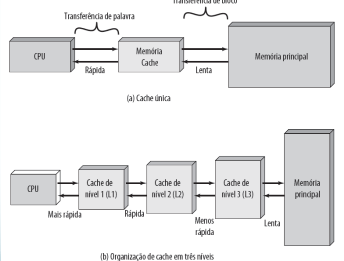
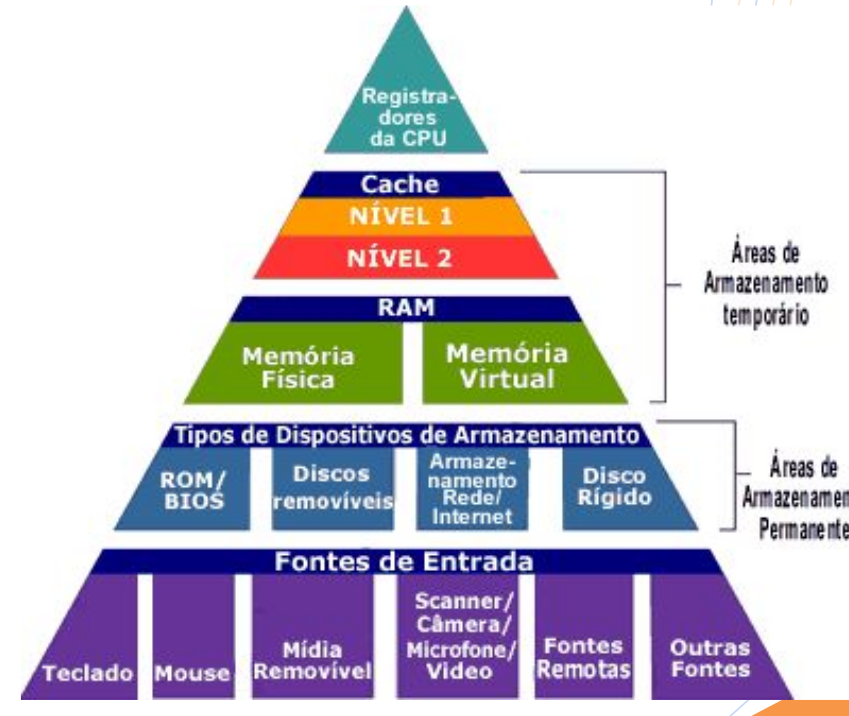

# Aula 3 - Memória

* A memória do computador é organizada em uma hierarquia.
* No nível mais alto (mais perto do processador), estão os *registradores do processador*.
* Níveis de cache: Quando são usados múltiplos níveis, eles são indicados por
L1, L2 e assim por diante.

* Em seguida, vem a memória principal, que normalmente é uma memória dinâmica de acesso aleatório e dinâmico (DRAM). 
* Todos estas anteriores são considerados internas ao sistema de computação. 
* A hierarquia continua com a memória externa, com o próximo nível geralmente sendo um disco rígido fixo, e um ou mais níveis abaixo disso consistindo em mídia removível, como discos ópticos e fita.
* internas ao sistema: acessíveis diretamente pelo processador
* externas: acessíveis pelo processador por meio de um módulo de E/S
* À medida que descemos na hierarquia da memória, encontramos:
    * custo/ bit menor,
    * capacidade maior e
    * tempo de acesso mais lento
* Seria bom usar apenas a memória mais rápida, mas como ela é a memória mais cara, trocamos tempo de acesso pelo custo, usando mais da memória mais lenta
* O desafio de projeto é organizar os dados e os programas na memória de modo que as palavras de memória acessadas normalmente estejam na memória mais rápida
* Se a memória cache for projetada corretamente, então, na maior parte do tempo, o processador solicitará palavras da memória que já estão na cache, e não precisará buscar na DRAM.
* As restrições de projeto sobre a memória de um computador podem ser resumidas por três questões:
  - Quanto?
  - Com que velocidade?
  - Com que custo?

* **Quanto?** Se houver capacidade de armazenamento, os programas provavelmente usarão essa capacidade
* **Com que velocidade?** Para conseguir maior desempenho, a memória precisa ser capaz de acompanhar a velocidade do processador. Enquanto o processador está executando instruções, não gostaríamos que ele tivesse que parar, aguardando por instruções ou operandos da memória.
* **Com que custo?** Para um sistema prático, o custo da memória deve ser razoável em relação a outros componentes

* Diversas tecnologias são usadas para implementar sistemas de memória e, por meio delas existem as seguintes relações:
  * Tempo de acesso mais rápido, maior
custo por bit.
  * Maior capacidade, menor custo por bit.
  * Maior capacidade, tempo de acesso mais lento.

* O projetista enfrenta um dilema: ele gostaria de usar tecnologias com grande capacidade de memória, porque a capacidade é necessária e porque o custo por bit é baixo. Porém, para atender os requisitos de desempenho, ele precisa usar memórias caras, relativamente com menor capacidade e com menores tempos de acesso.

* Para sair desse dilema, é preciso não contar com um único componente ou tecnologia de memória, mas empregar uma hierarquia de memória.

* Assim, memórias menores, mais caras e mais rápidas são complementadas por memórias maiores, mais baratas e mais lentas.

* A chave para o sucesso dessa organização é a diminuição na frequência de acesso.

## Principais Características das Memórias

### Capaciade de Memória

* Para a memória interna, isso normalmente é expresso em termos de bits ou palavras. Os tamanhos comuns de palavra são 8, 16 e 32 bits.
* A capacidade da memória externa normalmente é expressa em termos de bytes.

### Unidade de Transferência de Memórias

* Para a memória interna, a unidade de transferência é igual ao número de linhas elétricas para dentro e para fora do módulo de memória. Isso pode ser igual ao tamanho da palavra, mas normalmente
é maior, como 64, 128 ou 256 bytes.
* O tamanho da palavra normalmente é igual ao número de bits usados para representar um inteiro e ao tamanho da instrução.
* Palavra: a unidade “natural” de organização da memória.