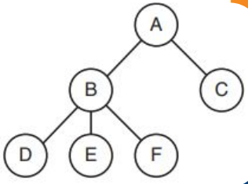
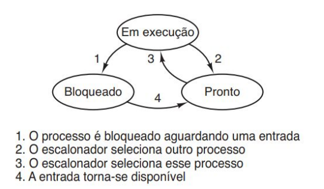

# Aula 2 - Processos e Threads

## Sistemas Operacionais (SO) - Processadores

* Um programa em execução
* Em um sistema de multiprogramação a CPU muda de um processo para outro muito rapidamente (em ms).
* Assim sendo a CPU transmite a sensação de que esses processos são paralelos (ou pseudoparalelismo).
* Esse mecanismo de troca rápida tem o nome de multiprogramação.
* Um programa executado duas vezes são dois processos.
* Um dado programa pode ser iniciado duas vezes
* Eles passam a ser processos distintos

### Espaço de endereçamento

* Cada processo é associado a um dado espaço de endereçamento. Isso consiste em uma lista de posições de memória que vão de 0 a algum máximo onde o processo pode ler e escrever.
* O espaço de endereçamento contém o programa executável, os dados do programa e sua pilha
* A pilha contém uma estrutura para cada rotina (conjuntos e instruções), que foi chamada mas ainda não encerrada.
* Armazena parâmetros de entrada, variáveis locais, variáveis temporárias, registradores, lista de arquivos abertos e lista de processos relacionados.
* Um processo é na essência um contêiner que armazena todas as
informações necessárias para executar um programa

### Exemplo de Processos
* O usuário pode ter inicializado um programa de edição de vídeo e mandou
converter um vídeo de uma hora para um formato MP4 (algo que pode levar
horas) e então foi navegar na web enquanto convertia.
* Ao mesmo tempo, um processo em segundo plano que “desperta” de tempos
em tempos para conferir e-mails que chegam pode ter começado a ser
executado.
* Periodicamente, o sistema operacional decide parar de executar um processo
e começa a executar outro, talvez porque o primeiro utilizou mais do que sua
parcela de tempo da CPU no último segundo ou dois
* Quando um processo é suspenso temporariamente assim, ele deve ser
reiniciado mais tarde no exato mesmo estado em que estava quando foi
parado.
* Isso significa que todas as informações a respeito do processo precisam ser
explicitamente salvas em algum lugar durante a suspensão. 

### Tabela de Processos
* Em muitos sistemas operacionais, todas as informações a respeito de cada
processo, fora o conteúdo do seu próprio espaço de endereçamento, estão
armazenadas em uma tabela do sistema operacional chamada de tabela de
processos

### Execução de Processos
* As principais chamadas de sistema de gerenciamento de processos são as que
lidam com a criação e o término de processos
* Exemplo: Um processo chamado de interpretador de comandos ou shell lê os
comandos de um terminal. O usuário acabou de digitar um comando
requisitando que um programa seja compilado. O shell tem de criar agora um
novo processo que vai executar o compilador. Quando esse processo tiver
terminado a compilação, ele executa uma chamada de sistema para se
autofinalizar.
* Um processo pode criar um ou mais processos (chamados de processos filhos). Então temos processos pais e processos filhos
* A estrutura desses processos pode ser organizada em um estilo de árvore, como na figura ao lado

    

    

          <ul >
            <li> 
                Processos relacionados que estão cooperando para finalizar alguma tarefa muitas vezes precisam comunicar-se entre si e sincronizar as atividades.
            </li>
            <li>
                Outras chamadas de sistemas de processos permitem requisitar mais memória (ou liberar memória não utilizada),esperar que um processo filho termine etc.
            </li>
            <li>
                Quando um usuário envia um sinal do teclado, o sinal é entregue a todos os membros do grupo de processos associados com o teclado no momento (em geral todos os processos ativos que foram criados na janela atual).
            </li>
            <li>
                Individualmente, cada processo pode pegar o sinal, ignorá-lo, ou assumir a ação predefinida, que é ser morto pelo sinal.
            </li>
            <li>
                Processos podem interagir entre si
            </li>
          </ul>
    

    

        
    

