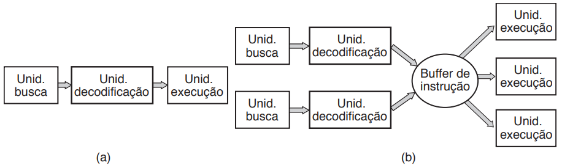

# Aula - Processadores

* O “cérebro” do computador é a CPU. Ela busca instruções da memória e as executa.
* O ciclo básico de toda
CPU é buscar a primeira instrução da memória, decodificá-la para determinar o seu tipo e operandos, executá-
-la, e então buscar, decodificar e executar as instruções
subsequentes.
* O ciclo é repetido até o programa terminar

* Cada CPU tem um conjunto específico de instruções
que ela consegue executar
* Desse modo, um processador x86 não pode executar programas ARM e um processador ARM não consegue executar programas x86.
* Como o tempo para acessar a memória para buscar uma instrução ou palavra dos operandos é muito maior do que o tempo para executar uma instrução, todas as CPUs têm alguns registradores internos para armazenamento de variáveis e resultados temporários.
* Desse modo, o conjunto de instruções geralmente contém instruções para carregar uma palavra da memória para um registrador e armazenar uma palavra de um registrador para a memória.

* Além dos registradores gerais usados para armazenar variáveis e resultados temporários, a maioria dos computadores tem vários registradores especiais que são visíveis para o programador.
* Um desses é o contador de programa, que contém o endereço de memória da próxima instrução a ser buscada. Após essa instrução ter sido buscada, o contador de programa é atualizado para apontar a próxima instrução
* Outro registrador é o ponteiro de pilha, que aponta para o topo da pilha atual na memória. A pilha contém uma estrutura para cada rotina que foi chamada, mas ainda não encerrada.
* Outro registrador ainda é o PSW (Program Status
Word — palavra de estado do programa). Esse registrador contém os bits do código de condições, que são estabelecidos por instruções de comparação, a prioridade da CPU, o modo de execução (usuário ou núcleo) e vários outros bits de controle.

* Para melhorar o desempenho, os projetistas de CPU há muito tempo abandonaram o modelo simples de buscar, decodificar e executar uma instrução de cada vez.
* Muitas CPUs modernas têm recursos para executar mais de uma instrução ao mesmo tempo. 
* Por exemplo, uma CPU pode ter unidades de busca, decodificação e execução separadas,  assim enquanto ela está executando a instrução n, poderia também estar decodificando a instrução n + 1 e buscando a instrução n + 2.
* Uma organização com essas características é chamada de pipeline

* A maioria das CPUs — exceto aquelas muito simples usadas em sistemas embarcados, tem dois modos, núcleo e usuário, como mencionado anteriormente
* Em geral, um bit no PSW controla o modo.
* Quando operando em modo núcleo, a CPU pode executar todas as instruções em seu conjunto de instruções e usar todos os recursos do hardware.
* Em computadores de mesa e servidores, o sistema operacional normalmente opera em modo núcleo, dando a ele acesso a todo o hardware.
* Na maioria dos sistemas embarcados, uma parte pequena opera em modo núcleo, com o resto do sistema operacional operando em modo usuário
* Programas de usuários sempre são executados em modo usuário, o que permite que apenas um subconjunto das instruções possa ser executado e um subconjunto dos recursos possa ser acessado.
* Geralmente, todas as instruções envolvendo E/S e proteção de memória são inacessíveis no modo usuário. Alterar o bit de modo PSW para modo núcleo também é proibido, claro.
* Para obter serviços do sistema operacional, um programa de usuário deve fazer uma chamada de sistema, que, por meio de uma instrução TRAP, chaveia  do modo usuário para o modo núcleo e passa o controle para o sistema operacional.