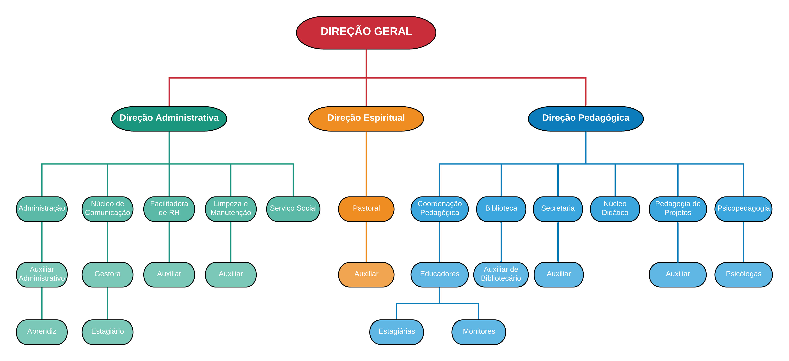
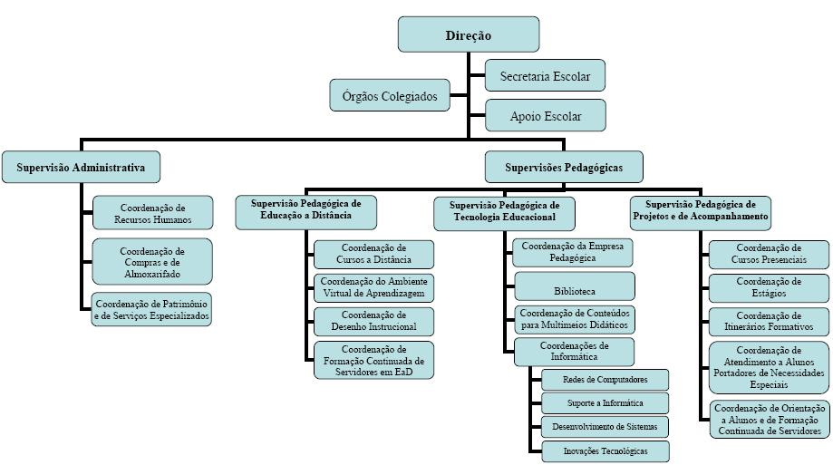
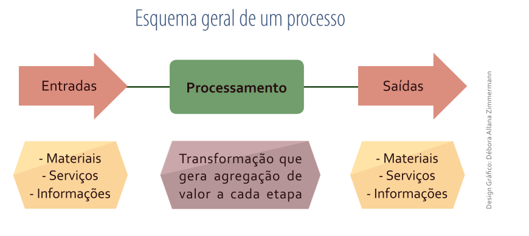

# Aula 1 - Gestão por processos; Aborgadem empresarial funcional; Abordagem empresarial por processos

## 1. Exposição: Abordagem funcional (organogramas)

* Desde a revolução industral nos esforçamos em encontrar métodos para melhorar a eficiência produtiva das organizações

* Representar esses processos é de grande relevância para torna-los mais eficientes;

* Os organogramas consistem em uma forma horizontal das estruturas de uma empresa.

* Um organograma permite compreender os setores de uma empresa em como suas respectivas hierarquias.

Figura do site https://instituto.cancaonova.com/organograma/

Figura do site https://crmes.org.br/institucional-2/organograma/

Figura do site http://etcdf.com.br/?page_id=675

* Melhores empresas criam estruturas estáveis

* Processos são altamente precisos

* Organogramas não possibilitam compreender como os departamentos de uma empresa se relacionam.

* Se faz necessário ter uma abordagem horintal.

## 2. Exposição: Abordagem por processos (integração horizontal)

* Na visão por processo uma empresa é entendida como uma série de cadeias integradoras com o propósito de antender o mercado.

* O processo é um conjunto de atividades que se relacionam para criar um resultado de valor para o cliente - Hammer (2007).

* De acordo com Davenport (1994), devem estar ordenadas cronologicamente, com início, fim e entra-
das e saídas claramente definidas.

Ebook - Business Process Modeling - Leandro Fabian Almeida Escobar

* Essa visão valoriza:
    * Compreender a relação dos departamentos da empresa
    * Relação entre seus colaboradores
    * Relação entre fornecedores e parceiros de negócios
    * Não elimina a visão funcional, mas uma forma nova de entender, planejar e executar as atividades dentro da empresa

Ebook - Business Process Modeling - Leandro Fabian Almeida Escobar

# 2.1 Atividade  em equipe: Desenhar uma cadeia de valor

## 3. Exposição: Processos de negócios (requerem agregação de valor) e Processos de apoio (requerem economia) 

### 3.1 Atividade  em equipe: Selecionar uma empresa ou um setor e listar os processos de negócios e de apoio (não é exaustivo)