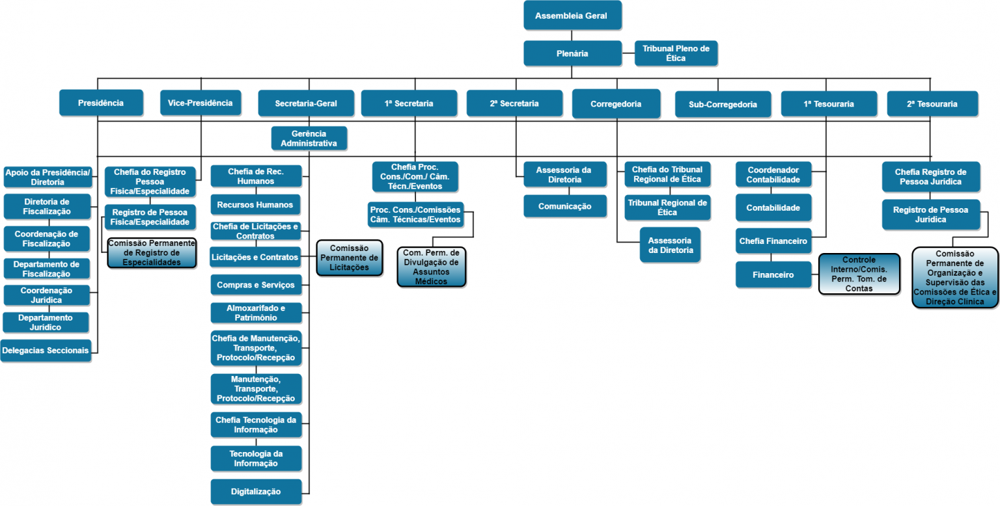

# Aula 1 - Gestão por processos; Aborgadem empresarial funcional; Abordagem empresarial por processos

## 1. Exposição: Abordagem funcional (organogramas) - 20min

* Desde a revolução industral nos esforçamos em encontrar métodos para melhorar a eficiência produtiva das organizações

* Representar esses processos é de grande relevância para torna-los mais eficientes;

* Os organogramas consistem em uma forma horizontal das estruturas de uma empresa.

* Um organograma permite compreender os setores de uma empresa em como suas respectivas hierarquias.

## 2. Exposição: Abordagem por processos (integração horizontal) - 30min

# 2.1 Atividade  em equipe: Desenhar uma cadeia de valor

## 3. Exposição: Processos de negócios (requerem agregação de valor) e Processos de apoio (requerem economia) 

### 3.1 Atividade  em equipe: Selecionar uma empresa ou um setor e listar os processos de negócios e de apoio (não é exaustivo)