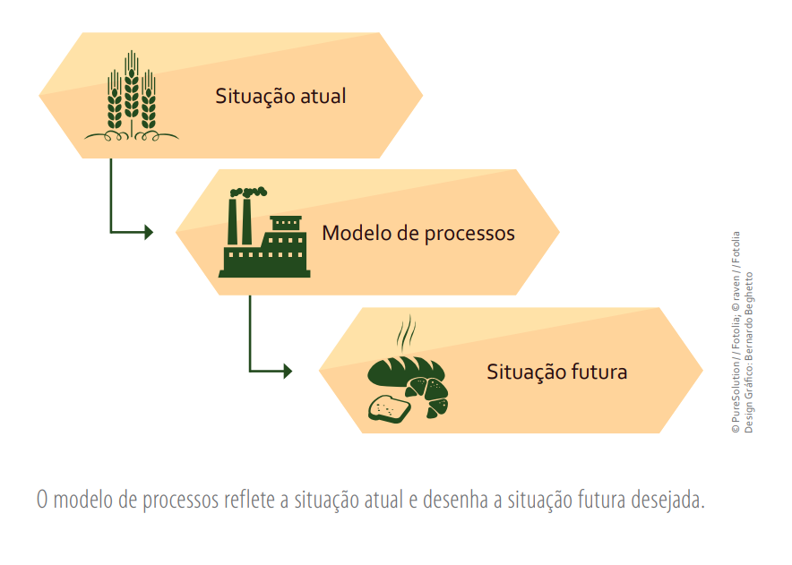
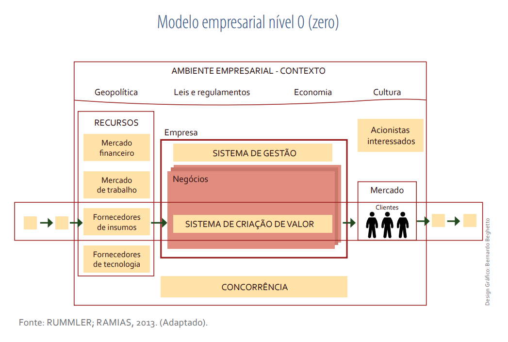
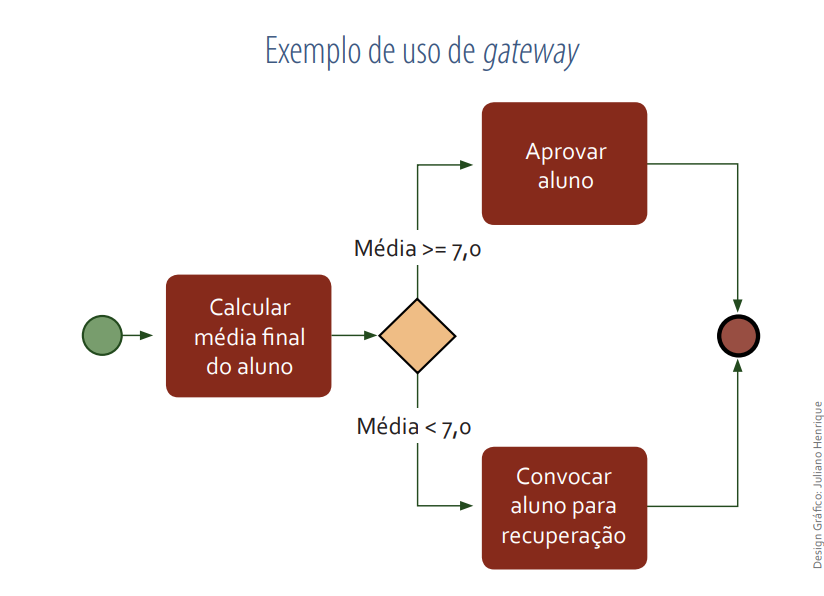
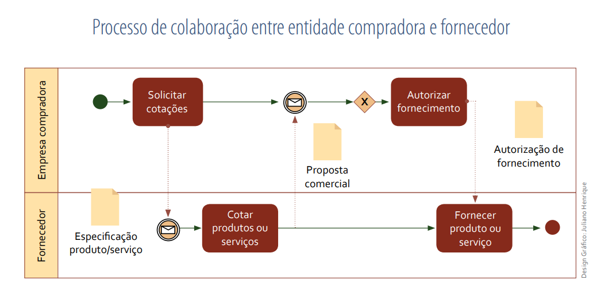

# Aula 2 - BPMN

## Revisão da Última aula

* Abordagem funcional
* Abordagem por Processos
* Cadeia de Valor

## Tópicos dessa aula

* 1. Exposição: Motivos para modelar processos de negócios
* 2. Exposição: Notação BPMN é formal
* 2.1 Exemplo prático (professor + estudantes)
* 2.2 Atividades

## Motivos para modelar processos de negócios

* Preencher lacunas que existem entre a situação atual e situação futura
* É importante especificar os recursos e sequências de trabalho
* A finalidade consiste representar como o processo é ou como deve ser realizado

Ebook - Business Process Modeling - Leandro Fabian Almeida Escobar

* Os modelos de processos devem
    * Ser feitos de acordo com uma arquitetura empresarial que forneça uma visão clara e detalhada
    * Verificar como os recursos de TI da organização funcionam em conjunto
    * Precisam incluir elementos de processos de negócios e elementos estratégicos
    * os recursos de TI e as estratégias devem se alinhar para gerar valor para o cliente.

* Os modelos elaborados devem 
    * Detalhar os elementos que fazem parte das cadeias de valor da empresa
    * Os processos devem ser extensivamente explorados
    * Os recursos de TI que serão alocados para sua realização
    * Apresentar as características sistêmicas da organização

Ebook - Business Process Modeling - Leandro Fabian Almeida Escobar

* A arquitetura de negócios deve expressar:
    * Todos os processos capazes de gerar valor para o cliente. 
    * Retrata claramente quais são os principais processos de negócios.
    * Identificando quais são seus processos (AITKEN; STEPHENSON; BRINKWORTH, 2010; SPANIY, 2010)
    * Essas definições complementam, e não duplicam, as estruturas da organização.
    * Deve estabelecer como o desempenho do processo será avaliado
    * Mediante a definição de quais são suas saídas e seus indicadores-chave de desempenho (Key Performance Indicators – KPIs)

* Objetivos e benefícios da modelagem de processos
    * A empresa estabelece uma visão clara e estruturada de quais são os elementos que se integram em suas cadeias para que seja possível gerar valor
    * Essa integração permite um gerenciamento de recursos mais eficiente (Davenport (1994))
    * Aumenta tanto o grau de eficiência Quanto o de eficácia.
    * Uniformização da linguagem e da comunicação
    * Os modelos de processos comunicam a todos os funcionários da empresa como as atividades são realizadas
    *  Define quem são os responsáveis por cada uma delas e quais são os recursos necessários para realizá-las.

## Notação BPMN é formal

* A modelagem de processos é uma atividade de (Aagesen e Krogstie (2013) e Campos (2013)): 
    * Mapeamento
    * Análise
    * Estruturação 
    * Otimização
    * Documentação das atividades ou trabalhos realizados nas empresas
    * Regras de negócios e recursos que devem ser consumidos para sua execução.

* (Unified Modeling Language) tem ocupado um espaço valioso na rotina de otimização empresarial.

* Aagesen e Krogstie (2013), ao tratarem do uso da modelagem de processos, citam cinco categorias gerais:
    * Criação de sentido
    * Gestão da qualidade:
    * Implementação do modelo
    * Desenvolvimento de software

* O BPMN (Business Process Modeling Notation)
    * Proposto por White, em 2004
    * oferecer um formato para elaboração de processos que seja facilmente compreendido
por todos os usuários
    * profissionais da área de negócios, de gestão, da qualidade ou do desenvolvimento de software
* Sua abrangência compreende:
    * Analistas de negócios, que criam o esboço inicial do processo 
    * Desenvolvedores técnicos
    * Executivos que farão o gerenciamento e monitoramento dos processos

### Objetos de fluxos

Ebook - Business Process Modeling - Leandro Fabian Almeida Escobar

* eventos de início;
* eventos intermediários (ocorrem durante a execução do processo e podem mudar seu estado);
* eventos de fim (têm como característica terminar o processo).

### Atividades

* As atividades expressam o trabalho realizado nas empresas e representam o nível
mais baixo na descrição do que deve ser realizado no processo.

Ebook - Business Process Modeling - Leandro Fabian Almeida Escobar

* Recomenda-se que as atividades sejam nomeadas com verbos no infinitivo (Rosemann, De Bruin e Power (2006))

* __Tarefas__: são atividades simples e indivisíveis. Isso significa que uma vez iniciada, deve ser terminada, pois se trata de uma unidade de processamento.

* __Subprocessos:__ são atividades compostas e agrupadas para simplificar o modelo. Geralmente, os subprocessos são grupos de atividades repetitivas, com entrada, uma lógica interna e, ao menos, uma saída. Uma vez agrupadas como
subprocessos, elas podem ser reaproveitadas em outros processos.

### Gateways

Ebook - Business Process Modeling - Leandro Fabian Almeida Escobar

* Representa fluxos convergentes ou divergentes
* Os gateways podem possuir regras de funcionamento

Ebook - Business Process Modeling - Leandro Fabian Almeida Escobar

## Exemplos práticos

Ebook - Business Process Modeling - Leandro Fabian Almeida Escobar

Ebook - Business Process Modeling - Leandro Fabian Almeida Escobar

## Atividades

O atendente recebe o pedido de uma pizza e o registra no sistema. O pizzaiolo monta a pizza e então a coloca no forno. O pizzaiolo verifica se a pizza está pronta. Se ela estiver queimada, então o processo é reiniciado. Caso contrário, a pizza é encaixotada. O entregador faz a entrega da pizza, recebe o pagamento e finaliza o processo.