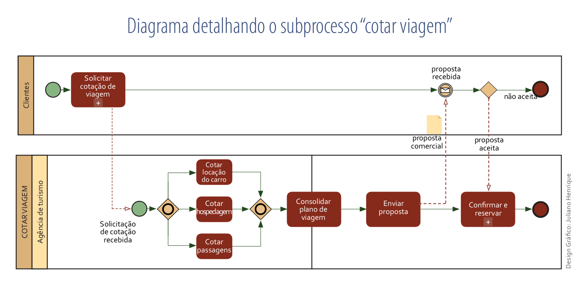
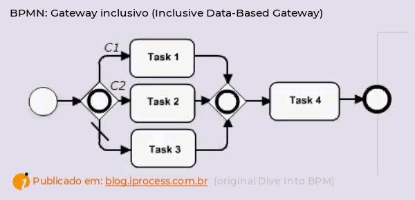
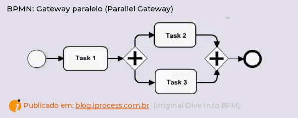
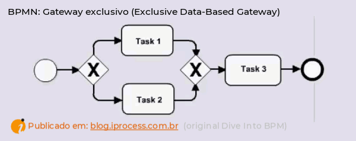
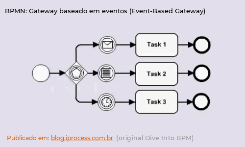

# Aula 3 - BPMN

## Revisão da Última aula

* Exposição: Motivos para modelar processos de negócios
* Exposição: Notação BPMN é formal
* Exemplo prático (professor + estudantes)

## Tópicos dessa aula

* 3 Exposição: Semânticas específicas
* 3.1 Gateways inclusivos
* 3.2 Gateways paralelos
* 3.3 Erros e exceções
* 3.4 Cancelamento de atividades

## 3.1 Gateways inclusivos - 10 min 8

Ebook - Business Process Modeling - Leandro Fabian Almeida Escobar

* O gateway inclusivo funciona como uma porta lógica “OR”, também baseado em dados.

https://blog.iprocess.com.br/2021/05/diferencas-entre-os-gateways-de-bpmn-com-animacoes/

Ebook - Business Process Modeling - Leandro Fabian Almeida Escobar

Atividade - Em uma dada empresa a criação de uma ordem de serviço pode ser feita tanto por meio de um sistema de computador como por meio de uma requisição ao departamento técnico. Depois disso, essa ordem entra dentro de um "backlog" e fica no aguardo para ser processada.  

## 3.2 Gateways Paralelo - 30 min

O gateway paralelo funciona como uma porta lógica “E”.

https://blog.iprocess.com.br/2021/05/diferencas-entre-os-gateways-de-bpmn-com-animacoes/

Atividade - Um mecânico de máquinas agrículas deve iniciar procedimento de regulação de uma determinada válvula de um trator. Para executar esse procedimento a chave catraca deve ser fixada no pino de alívio de pressão ao mesmo tempo que a chave borboleta deve estar agrupada ao exaustor de efusão. Depois disso a valvula é aberta e a pressão é liberada. Represente esse processo.

## 3.3 Gateways Exclusivo - 30 min

O gateway exclusivo funciona como uma porta “XOR”

https://blog.iprocess.com.br/2021/05/diferencas-entre-os-gateways-de-bpmn-com-animacoes/

Atividade - Uma empresa de contabilidade fornece comida para seus funcionários. Esse processo pode ser feito apenas mediante a uma única empresa. Se essa empresa constatar a "Comida Familiar" para trazer marmitas a semana inteira, então ela não pode entrar em contato com a "Coma muito bem e seja feliz". O contrário também é verdade. Após a solicitação, a comida é entregue a empresa de contabilidade e toda ela fica estocada em um armazem adequado

## 3.4 Gateways Baseados em Eventos 30 min 

https://blog.iprocess.com.br/2021/05/diferencas-entre-os-gateways-de-bpmn-com-animacoes/

Atividade - Um operador de telemarketing descobre um problema no sistema. Esse problema deve ser relatado para o setor técnico que é divido em finanças, experiência do usuário e cadastro de produto. Se o problema for alguma incoformidade financeira, então este deve ser relatdo para finanças. Se o prolema esiver vinculado a alguma inconsistência no produto, então este deve ser relatdo para "cadastro do produto". Contudo, se o problema estiver vinculado a alguma não conformidade do início ao fim da experiência do usuário com o produto, o mesmo - então, deve ser relatado para experiência do produto. Depois disso a área notificada deve prestar a manutenção correspondente e então prestar a devida manutenção.

## 3.3 Erros e exceções

https://blog.iprocess.com.br/2013/04/respondendo-a-duvidas-vale-usar-evento-de-erro-em-bpmn-para-tratar-excecao-de-negocio/

Atividade - Um petshop é responsável por lavar cachorros e gatos. Os animais aguardam dentro do setor de espera em fila. Quando a vez do animal chega, ele é disposto em um local para ser lavado ou ser tosado. Então, o animal é transferido para um outro setor aguardando o seu tutor vir busca-lo. Alguns animais são enviados de volta de carro. Neste caso espera-se que três animais neste contrato se juntem e, então, sejam enviados para o carro. Em alguns casos o tosador pode ferir o animal. Nestes casos o fluxo deve ser interrompido e o animal deve ser enviado a um veterinário onde este, por sua vez, fornecerá o tratamento correto. O tutor do animal deve ser informado da situação o quanto antes.

## Atividade 

#Questão 1041220 - Modelagem de Processos de Negócio (BPM), BPMN (Bussines Process Modeling Notation), FGV, 2022, Prefeitura de Manaus - AM, Analista de Suporte de Tecnologia da Informação
Sobre a notação BPMN e seus elementos, analise as afirmativas abaixo:

I. Atividade é um elemento não divisível, que representa um trabalho que precisa ser executado dentro do processo.

II. Gateways são decisores de fluxo do processo e são representados por círculos.

III. Eventos podem representar a espera de que um fato aconteça para iniciar/prosseguir a execução do processo ou então sinalizar que o processo produzirá a ocorrência de um fato durante ou ao término de sua execução.

Está correto apenas o que se afirma em

A) I.

B) II. 

C) III.

D) I e II.

E) I e III. 

Acerca da gestão de processos, julgue o item. 

O BPMN permite a indicação de eventos de início, intermediários e de fim, além dos fluxos de atividades e mensagens, da comunicação intranegócio e da colaboração internegócio. 

C) Certo

E) Errado

